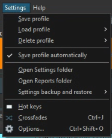

# 📘 Broadcast Scheduler Installation Guide

## Requirements

- Windows 10 / Windows 11
- Python 3.12+
- RadioBOSS
- Tkinter

## Installation

```bash
git clone https://github.com/mixnetwork1959/BroadcastScheduler.git
cd BroadcastScheduler
```

Copy:

```text
settings.example.json
```

to

```text
settings.json
```

In RadioBOSS open:

```text
Settings
→ Open Settings Folder
→ Presets
→ Schedule
```



Choose your own scheduler profile (*.sdl).

Example:

```json
{
  "admin_sdl":"C:/Users/USERNAME/AppData/Roaming/djsoft.net/RadioBOSS_xxxxxxxxx/Presets/Schedule/YourProfileName.sdl"
}
```

Start:

```bash
py scheduler.py
```

---

## Public Calendar

Open the **Public Calendar** tab.

Select the music programs you want to publish.

Click **Publish Website**.

Broadcast Scheduler creates:

```text
website_output/index.html
```

The generated HTML file is completely standalone and can be uploaded directly to your web server.

Broadcast Scheduler is **read-only** and never modifies your RadioBOSS scheduler.
