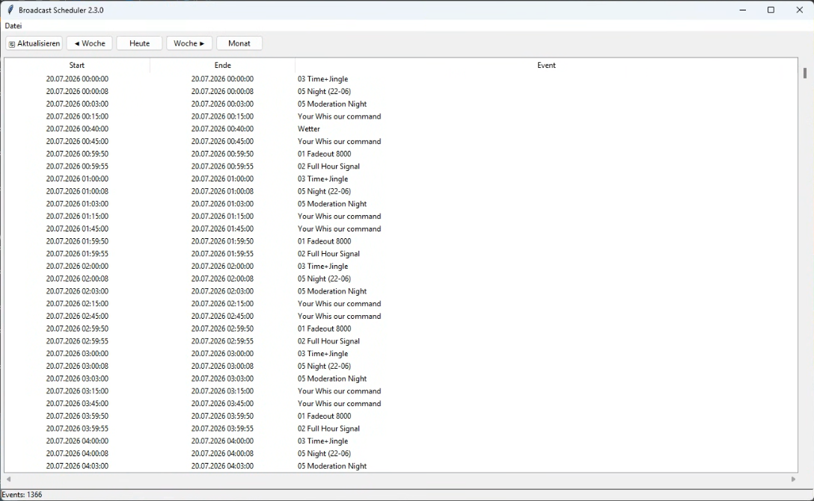

# 📅 Broadcast Scheduler


Broadcast Scheduler is an analysis and planning tool for **RadioBOSS**.

The application reads the original **Admin.sdl** file created by RadioBOSS and generates a clear weekly or monthly schedule. This makes it easy to review broadcast schedules, identify programming issues, and verify schedule configurations.

---

# 🖥 Screenshot



---

# ✨ Features

## Currently Available

- ✅ Read and parse `Admin.sdl`
- ✅ Analyze RadioBOSS events
- ✅ Automatically detect the current calendar week
- ✅ Generate a weekly schedule
- ✅ Sortable event table
- ✅ Toolbar
- ✅ Vertical and horizontal scrollbars
- ✅ Status bar
- ✅ Support for multiple minutes per hour (e.g. `17,43`)
- ✅ Support for `TimeType = 1`

---

# 🚧 Roadmap

## Version 2.4

- Display event groups
- Event details window
- Extended toolbar
- Improved status bar
- Week navigation

## Version 2.5

- Monthly view
- Detect scheduling gaps
- Detect overlapping events
- Conflict detection
- Search function

## Version 3.0

- PDF export
- CSV export
- Print support
- Color-coded event types
- Advanced filters
- Statistics

---

# 📂 Project Structure

```text
BroadcastScheduler
│
├── checker.py
├── config.py
├── database.py
├── gui.py
├── LICENSE
├── models.py
├── parser.py
├── schedule_engine.py
├── scheduler.py
├── settings.example.json
├── README.md
└── screenshot_01.PNG
```

---

# ⚙ Requirements

- Windows 10 / Windows 11
- Python 3.14 or later
- RadioBOSS

---

# 🚀 Installation

Clone the repository:

```bash
git clone https://github.com/mixnetwork1959/BroadcastScheduler.git
```

Open the project folder:

```bash
cd BroadcastScheduler
```

Copy

```text
settings.example.json
```

to

```text
settings.json
```

Then edit the file and enter the path to your own **Admin.sdl** file.

Example:

```json
{
    "admin_sdl": "C:/Users/USERNAME/AppData/Roaming/djsoft.net/RadioBOSS_xxxxxxxxx/Presets/Schedule/Admin.sdl"
}
```

Start the application:

```bash
py scheduler.py
```

---

# 📅 Supported RadioBOSS Features

The scheduler currently supports:

- Days
- Hours
- Minutes
- Seconds
- TimeType 1

Support for additional RadioBOSS features will be added in future releases.

---

# 🎯 Project Goal

Broadcast Scheduler is **not intended to replace RadioBOSS**.

Its purpose is to provide a fast and convenient way to analyze your broadcast schedule and answer questions such as:

- Which events are scheduled for this week?
- Are there any scheduling gaps?
- Are there overlapping events?
- Are moderator events scheduled correctly?
- Are news events configured correctly?
- Is the broadcast schedule working as intended?

---

# 🤝 Contributing

Bug reports, feature requests, and pull requests are always welcome.

---

# 📜 License

This project is licensed under the **MIT License**.

For more information, see the **LICENSE** file.

---

# 👤 Author

**Raymond Ummels**

Developed with the assistance of ChatGPT.

---

⭐ If you find this project useful, please consider giving it a **Star** on GitHub.