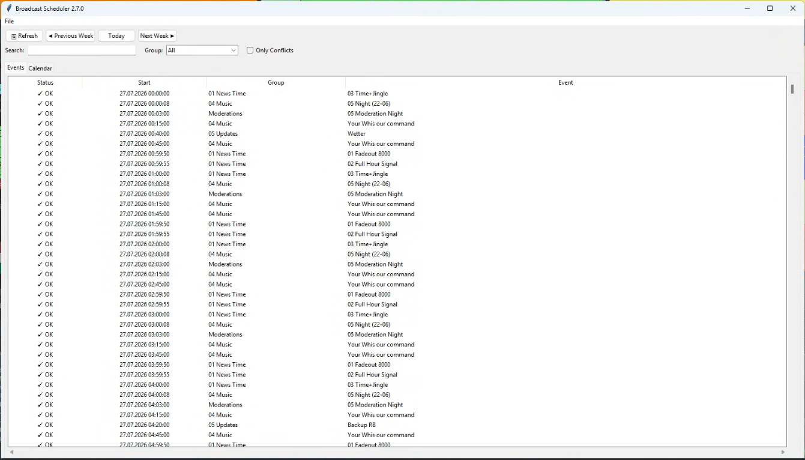
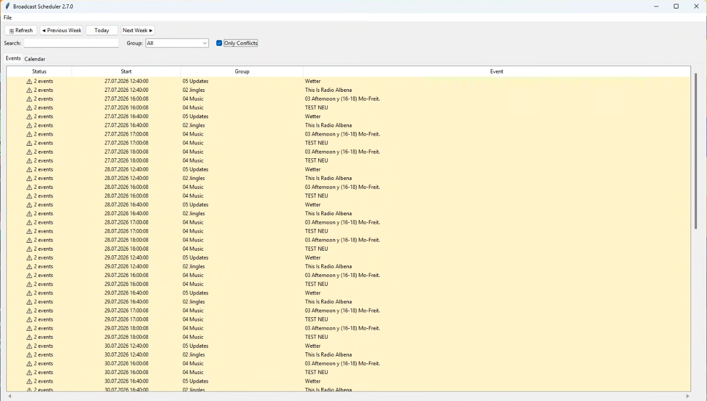

# 📅 Broadcast Scheduler for RadioBOSS


Broadcast Scheduler is a desktop analysis tool for **RadioBOSS**.

It reads the original **Admin.sdl** file and provides a clear visual
overview of your weekly broadcast schedule. The application helps
administrators verify scheduler configurations, review simultaneous
events, and inspect the complete weekly schedule before going on air.

------------------------------------------------------------------------

# ✨ Features

-   ✅ Native Windows desktop application
-   ✅ Weekly calendar view
-   ✅ Event list
-   ✅ Original RadioBOSS event colors
-   ✅ Automatic simultaneous event detection
-   ✅ Event details (double click)
-   ✅ Search
-   ✅ Group filter
-   ✅ Show only simultaneous events
-   ✅ Previous / Today / Next Week navigation
-   ✅ Automatic scroll to current time
-   ✅ Status bar
-   ✅ Modular architecture

------------------------------------------------------------------------

# 🖥 Screenshots

## Start View



## Weekly Calendar


## Simultaneous Events



------------------------------------------------------------------------

# 📂 Project Structure

``` text
BroadcastScheduler
│
├── analyzer.py
├── config.py
├── database.py
├── gui.py
├── gui_calendar.py
├── gui_filter.py
├── gui_menu.py
├── gui_statusbar.py
├── gui_toolbar.py
├── gui_tree.py
├── gui_treeview.py
├── models.py
├── parser.py
├── schedule_engine.py
├── scheduler.py
├── scheduler_controller.py
├── settings.example.json
├── README.md
└── LICENSE
```

------------------------------------------------------------------------

# ⚠ Simultaneous Event Detection

Broadcast Scheduler detects events that are scheduled to start at
exactly the same time.

These events are highlighted in:

-   the Event List
-   the Weekly Calendar

A simultaneous start is **not automatically an error**. It simply
indicates that multiple scheduler events begin at the same scheduled
time and should be reviewed by the administrator.

------------------------------------------------------------------------

# 🎨 Calendar Colors

The calendar uses the original **RadioBOSS event colors** stored in the
`Admin.sdl` file.

This means the scheduler automatically reflects the colors configured
inside RadioBOSS.

------------------------------------------------------------------------

# ⚙ Requirements

-   Windows 10 / Windows 11
-   Python 3.12 or newer
-   RadioBOSS
-   Tkinter (included with Python)

------------------------------------------------------------------------

# 🚀 Installation

Clone the repository:

``` bash
git clone https://github.com/mixnetwork1959/BroadcastScheduler.git
```

Open the project folder:

``` bash
cd BroadcastScheduler
```

Copy:

``` text
settings.example.json
```

to:

``` text
settings.json
```

Edit the file:

``` json
{
  "admin_sdl": "C:/Users/USERNAME/AppData/Roaming/djsoft.net/RadioBOSS_xxxxxxxxx/Presets/Schedule/Admin.sdl"
}
```

Start the application:

``` bash
py scheduler.py
```

------------------------------------------------------------------------

# 📅 Supported RadioBOSS Features

Current support:

-   Days
-   Hours
-   Minutes
-   Seconds
-   TimeType 1
-   Multiple minutes per hour
-   Original RadioBOSS colors

Support for additional RadioBOSS scheduling features will be added in
future releases.

------------------------------------------------------------------------

# 🎯 Project Goal

Broadcast Scheduler is **not intended to replace RadioBOSS**.

Its purpose is to provide administrators with a fast visual overview of
their scheduler configuration.

Typical questions it helps answer are:

-   Which events are scheduled this week?
-   Are multiple events starting at the same time?
-   Is the weekly schedule complete?
-   Are all events enabled?
-   Does the schedule look as expected before going live?

The application intentionally focuses on **schedule verification**, not
on simulating the RadioBOSS playout engine.

------------------------------------------------------------------------

# 🚧 Roadmap

## Version 3.1

-   Improved analyzer
-   Additional RadioBOSS TimeTypes
-   Better event information
-   Performance improvements

------------------------------------------------------------------------

# 🤝 Contributing

Bug reports, feature requests and pull requests are always welcome.

------------------------------------------------------------------------

# 📜 License

This project is licensed under the **MIT License**.

------------------------------------------------------------------------

# 👤 Author

**Raymond Ummels**

Developed with the assistance of ChatGPT.

------------------------------------------------------------------------

⭐ If you find this project useful, please consider giving it a **Star**
on GitHub.
