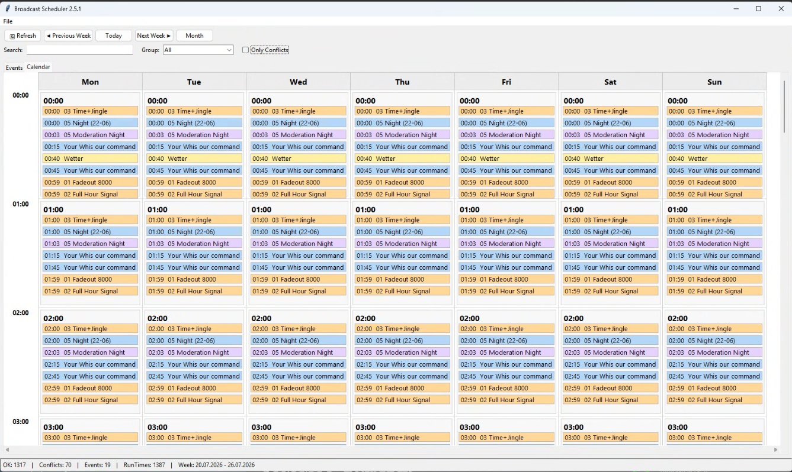
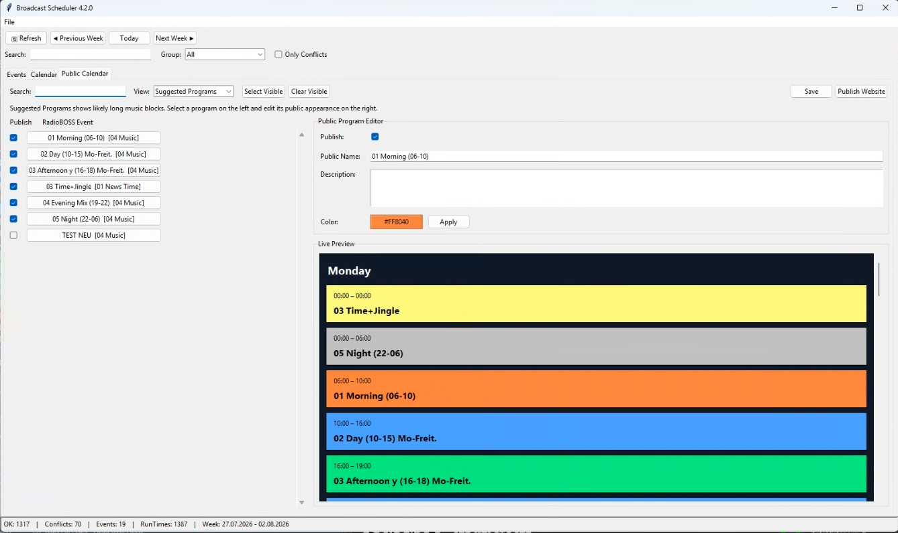
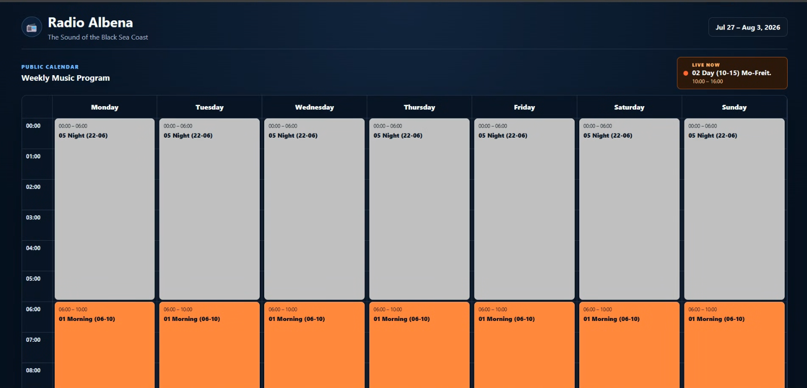

# 📅 Broadcast Scheduler for RadioBOSS


> **A free open source companion tool for RadioBOSS.**
>
> Analyze your scheduler, detect conflicts and generate a beautiful public program schedule for your website.

Broadcast Scheduler is an open source desktop application for **RadioBOSS**.

It helps radio stations analyze, verify and publish their broadcast schedules.

Besides a powerful Schedule Analyzer, Broadcast Scheduler now includes a **Public Calendar Website Generator** that creates a modern weekly program schedule for your station website with a single click.

---

## 📚 Documentation

- 📘 Installation Guide (`INSTALL.md`)
- 📖 User Guide (`USER_GUIDE.md`)
- 📜 Changelog (`CHANGELOG.md`)

---

# ✨ Features

## 📅 Schedule Analyzer

- Weekly schedule overview
- Monthly preview
- Conflict detection
- Search and filters
- Group filter
- Event details
- Status bar
- Modular architecture

## 🌍 Public Calendar

- Public program editor
- Custom public names
- Program descriptions
- Custom colors
- Enable / disable programs
- Live preview

## 🌐 Website Generator

- Publish Website button
- Standalone HTML output
- Responsive layout
- Live "Now Playing"
- Current time indicator
- Live progress bar
- No local web server required

---

# 🖥 Screenshots

## Schedule Analyzer



## Public Calendar Editor



## Generated Website



---

# 🌍 Public Calendar

Choose which music programs should appear on your website.

For every program you can define:

- Public name
- Description
- Color
- Visibility

The generated website is completely standalone and can be uploaded directly to any web server.

---

# 🌐 Website Generator

Click **Publish Website** to generate:

```text
website_output/index.html
```

The generated website includes:

- Weekly schedule
- Live Now Playing
- Current time line
- Progress bar
- Responsive layout

No local web server is required.

---

# 🚧 Roadmap

## Version 5.0

- Broadcast Scheduler Suite
- Statistics
- Website Publisher
- FTP Upload
- Themes
- Multi-language support

---

# 📜 License

MIT License

---

# 👤 Author

**Raymond Ummels**

Developed with the assistance of ChatGPT.
